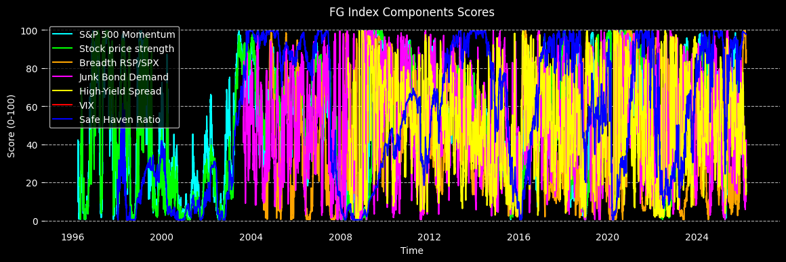
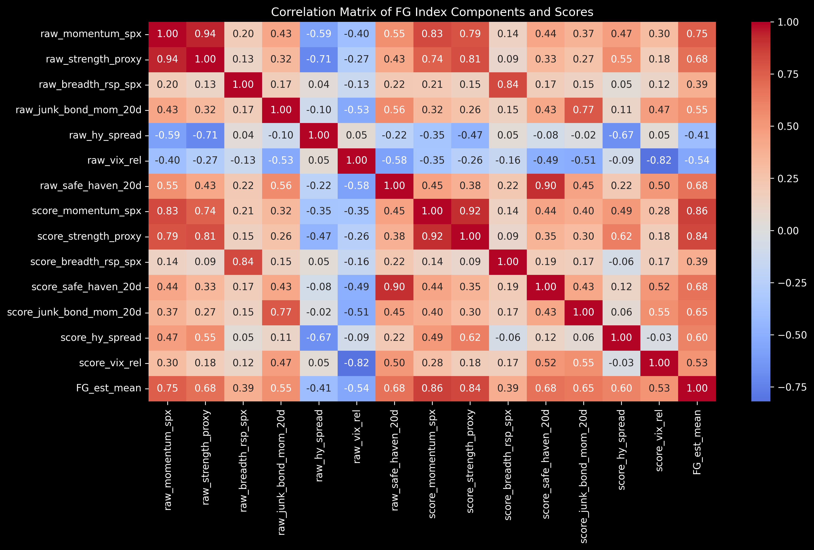
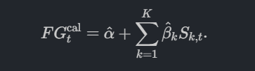
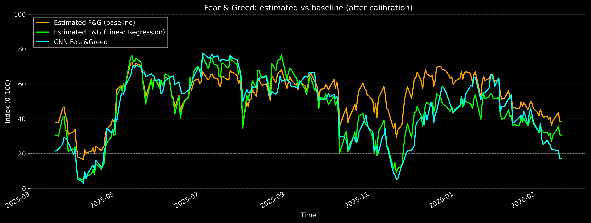
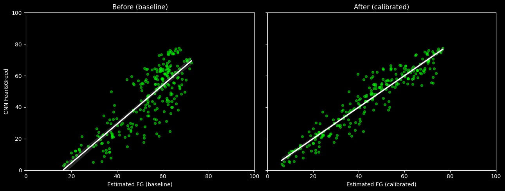
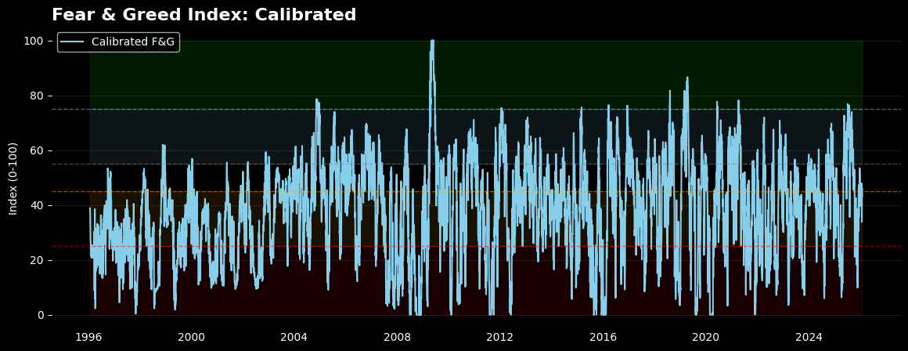

# CNN Fear & Greed Estimator

---

`Finance, Machine Learning, Sentiment Analysis, Statistical Modeling`

This project aims to **reconstruct a *CNN Fear & Greed*-type index** from public data (Yahoo Finance, FRED) by combining several market indicators (equities, volatility, bonds, credit).
The objective is twofold:

1. **Match the official CNN Fear & Greed index as closely as possible** (a “benchmark-driven” approach).
2. **Propose a transparent and interpretable theoretical index** that can be used in quantitative analyses or trading strategies.

The full pipeline is implemented in Python (pandas, scikit-learn, yfinance) and documented in a main notebook.


---

## Project Structure

```text
FGIndexEstimator/
├── data/                   # Raw and preprocessed data
├── deploy/                 # Deployment interfaces (API, dashboard)
├── img/                    # Images for the README and the notebook
├── notebooks.ipynb         # Main analysis and estimation notebook
├── requirements.txt        # Python dependencies
└── README.md               # Project documentation
```

---

## Data

* **Yahoo Finance (`yfinance`)**

  * `^GSPC` – S&P 500 (US equity market level).
  * `^VIX` – implied volatility index on S&P 500 options.
  * `RSP` – S&P 500 equal-weight ETF (proxy for breadth / participation).
  * `TLT` – long-term Treasuries ETF (proxy for safe-haven asset).
  * `HYG` – US high-yield ETF (proxy for appetite for risky credit).

* **FRED (St. Louis Fed)**

  * `BAMLH0A0HYM2` – ICE BofA US High Yield Option-Adjusted Spread (yield spread high-yield vs investment grade).
  * `PUTCALL` – CBOE put/call ratio (if available for the API used).

* **CNN reference**

  * Historical series of the **CNN Fear & Greed** index (0–100 score) downloaded from CNN Business, used as a **benchmark** for calibration.

All series are aligned on a **US business-day calendar**. Holidays and missing values are handled via **forward-fill** on prices/liquidity, which makes it possible to compute moving averages and returns without breaks.

---

## Methodology

### 1. Construction of raw indicators

From prices and spreads, the `build_raw_indicators` script computes several raw components:

1. **Market momentum – `momentum_spx`**
   Relative distance of the S&P 500 from its 125-day moving average.

   High value ⇒ market above its trend ⇒ **Greed**.

2. **Trend / strength proxy – `strength_proxy`**
   Relative distance from the 200-day moving average.
   Captures the **strength of the long-term trend** (closer to CNN’s “52-week highs vs lows” component).

3. **Stock price breadth – `breadth_rsp_spx`**
   Over 60 days, we compare the performance of `RSP` (equal-weight) and the cap-weighted S&P 500.
   When equal-weight outperforms, the rise is **more broadly shared** ⇒ **Greed** signal.

4. **Safe haven demand – `safe_haven_20d`**
   20-day return difference equities vs Treasuries:

   * Positive value: equities > bonds ⇒ outflow from safe-haven assets ⇒ **Greed**.
   * Negative value: Treasuries outperform ⇒ **flight to safety / Fear**.

5. **Junk bond demand – `junk_bond_mom_20d` & `hy_spread`**

   * **`hy_spread`**: high-yield vs IG yield spread (FRED). High spread ⇒ risk aversion ⇒ component **inverted** at scoring.
   * **`junk_bond_mom_20d`**: 20-day return of `HYG` ETF. Positive momentum ⇒ strong demand for risky credit ⇒ **Greed**.

6. **Market volatility – `vix_rel`**
   Relative volatility: volatility above its trend ⇒ **Fear**, below ⇒ **Greed** (component inverted at scoring).

7. **Put/Call ratio – `put_call` (optional)**
   FRED series `PUTCALL` if available. High ratio ⇒ increased hedging / nervousness ⇒ **Fear** (inverted score).

### 2. Transformation into 0–100 scores

Each raw indicator Xt is converted into a **sentiment score** St ∈ [0,100] via a `percentile_score` function:

1. For each date t, we consider the available history {Xi} (i <= t) (with a minimum of `min_periods`, typically 252 days).
2. We compute the **percentile rank** of the current point in this history.
3. We map this rank to [0,100].
4. For “fear” variables (VIX, `hy_spread`, put/call), we invert the score so that a high score always means **Greed** and a low score means **Fear**.

This percentile-based approach is:

* **Dimensionless**: components become directly comparable regardless of their original units.
* **Adaptive**: extremes are defined relative to recent history, which avoids fixing arbitrary thresholds.




### 3. Construction of the composite index

The `compute_fear_greed` function aggregates component scores into a global index:

* **Theoretical** version: simple average of all available components.

* **Calibrated** version: linear combination of scores estimated by OLS regression on the CNN index:

   

  where a and w are adjusted to minimise the squared error over the period where the CNN index is observed.
  The resulting weights put strong emphasis on the **safe-haven** component, **momentum**, **volatility** and the **high-yield spread**, which is economically coherent.

---

## Results




### 1. Naive replication (simple average)

The first version of the index uses a simple average of component scores, without supervised calibration.

Over the common period with the CNN index:

* R ≈ 0.50
* RMSE ≈ 14 points (on a 0–100 scale)

Visually, this estimate appears **too smooth and too high**: it often stays around 60–70 when the CNN index falls into deep fear zones. The estimator captures the general trend but **misses sentiment drawdowns** and shows an **upward bias**.

### 2. Index calibrated by linear regression

A second version uses the same components but adjusts weights and intercept via **linear regression (OLS)** on recent CNN observations (≈ 250 days).

On this calibration/validation sample:

* RMSE ≈ **6.3**
* R ≈ 0.90
* Number of observations ≈ 250

The three models tested (Linear Regression, Ridge, Bayesian Ridge) deliver extremely similar performances, which confirms the **stability of the linear solution**.

| n° | Models on val             |   RMSE |     R2 | N obs |
| -- | ------------------------- | -----: | -----: | ----: |
| 1  | Linear Regression         | 6.3104 | 0.8970 |   250 |
| 2  | Ridge Regression          | 6.3104 | 0.8970 |   250 |
| 3  | Bayesian Ridge Regression | 6.3117 | 0.8969 |   250 |

The calibrated index now follows **much more closely the phases of euphoria and panic** observed by CNN, while remaining analytical (explicit linear combination of economic signals).

### 3. Regime interpretation (classification)



To better interpret the scores, the index is projected onto five categories:

> **Extreme Fear, Fear, Neutral, Greed, Extreme Greed** (via thresholds on [0,100]).

On the 251-day test period, the calibrated index reaches **76% accuracy** and a **weighted F1-score of 0.76**.

> The **Extreme Fear** and **Greed** regimes are particularly well identified (F1 ≈ 0.87 and 0.80).
> The **Fear** category remains the hardest to detect (F1 ≈ 0.50, with few observations), which reflects the difficulty of separating moderate caution from simple market “noise”.

|               | precision | recall | f1-score | support |
| ------------- | --------- | ------ | -------- | ------- |
| Extreme Fear  | 0.92      | 0.82   | 0.87     | 57      |
| Fear          | 0.75      | 0.38   | 0.50     | 8       |
| Neutral       | 0.70      | 0.81   | 0.75     | 57      |
| Greed         | 0.86      | 0.75   | 0.80     | 87      |
| Extreme Greed | 0.54      | 0.69   | 0.60     | 42      |
|               |           |        |          |         |
| accuracy      |           |        | 0.76     | 251     |
| macro avg     | 0.75      | 0.69   | 0.70     | 251     |
| weighted avg  | 0.78      | 0.76   | 0.76     | 251     |

Overall, the reconstructed index thus provides a **credible approximation of the CNN sentiment dynamics**, while remaining controllable and interpretable at the level of each component.

---

## How to run the project

1. **Clone the repository**

   ```bash
   git clone https://github.com/aurvl/FGIndexEstimator.git
   cd FGIndexEstimator
   ```

2. **Create the Python environment**

   ```bash
   python -m venv .venv
   source .venv/bin/activate   # on Windows: .venv\Scripts\activate
   pip install -r requirements.txt
   ```

3. **Configure keys and paths**

   * Create a `.env` file:

     * your **FRED API key** (`API_KEY`)

4. **Launch the notebook**

   ```bash
   jupyter notebook estimator.ipynb
   ```

   The notebook downloads the data (or reloads caches), computes the components, builds the naive index, then performs OLS calibration and evaluation.

---

## Limitations & possible extensions

* Some CNN components (number of new NYSE highs/lows, McClellan volume index, exact put/call) are not available as open data. They are therefore **approximated by proxies** (RSP vs SPX, HYG, FRED spreads, etc.).
* The current approach is deliberately **linear and transparent**. Non-linear models (Random Forest, Gradient Boosting, neural networks) could capture more complex interactions, at the cost of reduced interpretability.
* New sources (textual sentiment, sector ETF flows, order-flow) could enrich the index and improve detection of “intermediate” fear phases.

### **Refs**

> - [CNN Fear & Greed Index](https://edition.cnn.com/markets/fear-and-greed)
> - [Yahoo Finance API (`yfinance`)](https://pypi.org/project/yfinance/)
> - [FRED API](https://fred.stlouisfed.org/docs/api/fred/)